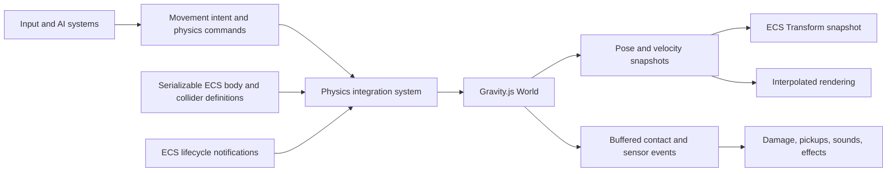

# ECS and 2D Physics Architecture Report

**Project:** ECSlime Engine + Gravity.js  
**Assessment date:** 2026-07-20

## Executive summary

Do not rebuild the ECS around `RigidBody`, and do not maintain unrestricted two-way synchronization between duplicate ECS and physics state.

The recommended architecture is an **ECS-owned game with an authoritative physics subsystem**:

- The ECS owns entity identity, composition, gameplay state, authoring data, serialization, and editor workflows.
- Gravity.js owns simulated pose, linear/angular velocity, contacts, and joints for physics-enabled entities.
- Serializable ECS components describe how a body should be created.
- A runtime integration service owns opaque body handles and the entity/body mapping.
- Gameplay systems submit commands such as force, impulse, target velocity, and teleport before a fixed physics step.
- The physics system publishes pose snapshots and buffered contact/sensor events after the step.
- No other system directly changes the transform or velocity of a dynamic physics body.

This is a stricter version of option 1. It avoids the dangerous part of a compatibility layer—two peers continuously overwriting each other—while preserving the good ECS, editor, and serialization work already present. It also keeps Gravity.js reusable as a standalone physics engine.

The ECS and a rigid-body solver solve different problems. An ECS organizes game data and behavior. A physics world maintains a tightly coupled numerical simulation containing bodies, shapes, contacts, solver caches, and joints. Neither needs to replace the other.

## What the codebase has today

### ECS engine

The reusable engine under [`src/engine`](../src/engine) has a compact sparse-set-style ECS:

- `Registry` owns entity allocation, packed component pools, tags, groups, systems, and deferred entity creation/destruction.
- `System` holds a packed list of matching entities based on a component signature.
- `Pool` maps entity IDs to packed component storage.
- `Game` and `Editor` manually schedule system updates.
- The component catalog, level manager, and generic serializer support editor-authored JSON levels.

These are valuable foundations. In particular, the editor, level format, gameplay systems, and component catalog would all be expensive to replace and are not made obsolete by physics.

There are some ECS constraints that should be addressed as part of the integration:

1. **Component changes do not automatically update system membership.** `Entity.removeComponent()` contains a TODO about this. Callers currently compensate with manual `addToSystem()` and `removeFromSystem()` calls.
2. **Structural changes are only partially deferred.** Entity creation/death is queued, but component changes and manual system membership changes are immediate. Mutating a packed system list while iterating it can skip an entity.
3. **Signatures are limited to 32 bits.** There are already 31 game component classes. JavaScript bitwise operations are 32-bit, so physics configuration components will immediately exhaust the current design.
4. **Scheduling is duplicated and implicit.** `Game.update()` and `Editor.update()` each encode ordering by hand, and their orders differ.
5. **Serialization reflects object implementation.** It uses constructor names and enumerable properties. Runtime-only physics handles would be serialized unless explicit metadata is added.
6. **System lifecycle has no hooks.** `Registry.clear()` removes system membership but cannot tell a subsystem to clear external state such as a physics world.

None of these require discarding the ECS. They are normal next steps for a small ECS that is gaining a stateful subsystem.

### Current movement and collision model

The existing model is kinematic rather than physical:

- `RigidBodyComponent` contains only `velocity` and `direction`; it is effectively a `MotionComponent`.
- `MovementSystem` integrates `position += velocity * deltaTime`.
- `CollisionSystem` performs an all-pairs AABB overlap test.
- `MovementSystem` responds to collision events by snapping entities outside obstacles and zeroing one velocity axis.
- Gameplay systems such as follow, scripting, destination, and player control write velocity directly.
- Damage, pickups, projectiles, and melee attacks consume the same collision event.

This is a coherent model for a top-down RPG. It should be kept temporarily as a **legacy kinematic backend**, but it must not operate on the same entities as the new physics backend.

### Gravity.js

Gravity.js already has the parts worth protecting as a standalone domain:

- Rigid bodies with mass, inertia, forces, impulses, friction, restitution, rotation, and filtering.
- Boxes, circles, polygons, capsules, and segments.
- Sweep-and-prune broad phase, narrow phase, contact manifolds, warm starting, and iterative constraint solving.
- Joints, continuous collision detection, force generators, and manifold pooling.
- A focused test suite; all 104 Gravity.js tests pass at the time of this assessment.

Its current public API is still demo-oriented rather than integration-oriented:

- **Resolved:** `World.getBodies()` now returns a detached, read-only snapshot, so callers cannot mutate world membership through the returned collection. Individual `RigidBody` objects are still mutable until the proposed handle/command API is introduced.
- **Resolved:** `World.addBody()` silently does nothing at `MAX_BODIES`.
- Bodies are referenced as mutable objects with process-global incrementing IDs.
- `SETTINGS` is a mutable module singleton rather than per-world configuration.
- Contact callbacks execute from inside constraint solving.
- Static and dynamic bodies exist through mass, but a true kinematic body type does not.
- A collision category named `SENSOR` is only a filter category; there is no non-resolving sensor/trigger shape behavior.
- **Resolved:** Substep settings exist, but `World.update()` does not itself perform the configured number of substeps.
- **Resolved:** Physics engine as package, instead of importing from `../../../gravity.js/src` build library and import using public API

Those are API and lifecycle refinements, not reasons to replace the solver.

## Problems in the current `PhysicsSystem` prototype

[`PhysicsSystem.ts`](../src/game/systems/PhysicsSystem.ts) is useful as a spike, but it should not become the final boundary in its current form.

### Competing authorities

`Game.update()` currently runs `PhysicsSystem`, followed later by AI systems, `MovementSystem`, and `CollisionSystem`. A physics-enabled entity can therefore be moved by Gravity.js, copied to ECS, moved again by `MovementSystem`, and collision-corrected again by the legacy collision path in one rendered frame.

This is the most important architectural bug: there must be exactly one writer for simulated pose and velocity.

### Incorrect fixed-step integration

The current code calls `world.update(deltaTime)` unconditionally and then may call it again in an accumulator loop, also using `deltaTime`. At roughly 60 FPS this commonly advances physics twice. At high refresh rates it mixes variable and fixed-frequency updates.

A physics solver should only receive a bounded, fixed step. Box2D's official simulation documentation similarly recommends a fixed primary step and treats substeps as an internal accuracy control ([Box2D simulation guide](https://box2d.org/documentation/md_simulation.html)). The classic accumulator rationale is described in [Fix Your Timestep](https://gafferongames.com/post/fix_your_timestep/).

### Incomplete entity coverage

The system requires `TransformComponent`, `RigidBodyComponent`, and `BoxColliderComponent`. Consequently:

- Static obstacles generally have a transform and box collider but no legacy rigid body, so they do not enter the physics world.
- Melee hitboxes and pickup triggers may have colliders without legacy motion, so they also do not enter it.
- Every admitted body is created as a mass-1 dynamic box, with rotation disabled.
- Other Gravity.js shapes, static bodies, materials, filters, bullets, and joints cannot be authored in the ECS.

Body type and collision shape are separate concepts and should be represented separately.

### Lossy transform conversion

The bridge currently has several conversion mismatches:

- `TransformComponent.rotation` is degrees, while Gravity.js rotation is radians.
- ECS collider dimensions are affected by transform scale in the legacy collision system, but the physics body ignores scale.
- The collider offset is added when creating the body, but not subtracted when copying the body position back to the entity transform.
- Physics rotation is not copied back at all.
- Initial ECS velocity is ignored.

Conversions should live in one tested adapter with an explicit pose convention.

### Polling instead of lifecycle integration

The bridge scans all matching ECS entities and all physics bodies each frame to discover additions/removals. `World.getBodies()` now returns a safe snapshot, so removals no longer mutate the collection being iterated, but the polling and lifecycle coupling remain. A level clear only clears ECS system membership; it does not directly clear the physics world.

The final design should receive safe entity/component lifecycle notifications and use an explicit world reset hook. Polling can remain as a debug invariant check, not the primary lifecycle mechanism.

### Gameplay knowledge inside infrastructure

The physics system subscribes to keyboard events, looks up the `player` tag, reads `PlayerControlComponent`, and applies player impulses. This couples a reusable physics subsystem to one game's controls.

Player input should produce movement intent or physics commands. The physics integration should not know what a player, enemy, arrow key, or spell is.

### Collision duplication

Gravity.js solves contacts, but the old `CollisionSystem` still detects gameplay collisions. This can produce disagreement between physical response and gameplay effects. The physics world should become the source of contact and sensor events for physics-enabled entities.

## Architectural principles

Any chosen solution should enforce these rules:

1. **One authority per property.** Dynamic pose and velocity belong to physics; authored configuration and non-physical gameplay state belong to ECS.
2. **One simulation clock.** Physics advances only in fixed steps, independently of render cadence.
3. **Commands before stepping, events after stepping.** Do not mutate the world from a solver callback.
4. **Configuration is serializable; runtime state is not.** Level files describe bodies and colliders, not runtime pointers or handles.
5. **Physics remains game-agnostic.** Gravity.js must not import ECS, game, renderer, input, or editor types.
6. **The adapter owns conversion.** Units, angle conversion, offsets, interpolation, and entity/body mapping have one implementation.
7. **Structural changes happen at safe points.** Body/entity creation and destruction cannot invalidate an active iteration or solver step.
8. **Legacy and physical motion are mutually exclusive.** During migration, an entity chooses one backend.

## Architectural options

### Option A: Minimal bidirectional compatibility layer

This is closest to the current prototype. ECS components and Gravity.js bodies both hold pose/velocity, and one `PhysicsSystem` copies values in both directions every frame.

#### Advantages

- Lowest initial implementation effort.
- Existing systems can continue reading and writing the current components.
- Easy to demonstrate a physics body inside the game quickly.
- Gravity.js remains standalone.

#### Disadvantages

- Ownership is ambiguous: the last system to write wins.
- Teleports, impulses, AI velocity, collision resolution, and editor dragging are difficult to distinguish from accidental overwrites.
- Synchronization order becomes part of gameplay behavior.
- Static bodies, sensors, joints, sleeping bodies, and multiple shapes make the bridge increasingly complex.
- Full scans and mutable object references make lifecycle bugs likely.
- Deterministic replay and debugging become much harder.

#### Assessment

Good only as a short-lived prototype. Do not make unrestricted two-way copying the permanent architecture.

### Option B: ECS game with an authoritative physics subsystem — recommended

The ECS keeps entity identity and body definitions. Gravity.js owns runtime simulation state. The adapter creates bodies, accepts explicit commands, steps the world, publishes events, and exports read-only pose snapshots.

This is still an integration layer, but it is **directional and phase-based**, not peer-to-peer synchronization.

#### Advantages

- Preserves the ECS, game, editor, level format, and most gameplay systems.
- Preserves Gravity.js as an independently testable physics package.
- Gives the solver a clear fixed-step boundary.
- Makes body lifecycle, collision events, and ownership testable.
- Supports non-physical entities naturally: UI, audio emitters, text, animation-only effects, and editor helpers do not need fake bodies.
- Allows gradual migration entity type by entity type.
- Closely matches the architecture of mature engines: physics is a world/subsystem with handles, commands, queries, and events.

#### Disadvantages

- A small amount of duplicated pose data remains for rendering and gameplay queries.
- Requires careful scheduling and lifecycle hooks in the ECS.
- Requires an explicit strategy for teleporting, kinematic control, interpolation, and authoring changes.
- Some existing systems must be rewritten to submit intent instead of changing physics-owned data.

#### Assessment

Best balance for this project. The duplicate pose is a deliberate snapshot/cache, not a second authority.

### Option C: Physics world as the core object model, with ECS attached around it

In this model a Gravity.js body becomes the primary identity for game-world actors. ECS entities either wrap body IDs or exist only for non-physics features.

#### Advantages

- Direct access to physical state for body-centric demos.
- Little mapping overhead when nearly every object is a rigid body.
- Physics lifecycle naturally dominates simulation ordering.

#### Disadvantages

- A game entity is broader than a rigid body. Menus, lights, particles, scripts, sounds, timers, inventory, cameras, and editor objects do not fit naturally.
- A body can have several shapes, and a gameplay entity can have no body or several physics objects connected by joints. Identity still does not become one-to-one in the general case.
- Rendering and serialization still need a projection of physics state, so synchronization is reduced but not eliminated.
- Gravity.js becomes coupled to game/editor concerns or grows a parallel entity model.
- Existing ECS gameplay, tests, editor, and levels would require a large rewrite without improving the solver itself.
- It weakens Gravity.js as a reusable standalone library.

#### Assessment

Reasonable for a physics sandbox whose objects are almost all bodies. It is a poor fit for this codebase and the intended RPG-like game.

### Option D: Make the physics solver ECS-native

Body state, shapes, contacts, and perhaps joints become ECS components. Broad phase, narrow phase, integration, and constraint solving become ECS systems operating directly on component pools.

#### Advantages

- No external body/entity map.
- Physics data can participate directly in ECS queries and tooling.
- Potentially excellent data locality if components are redesigned as structure-of-arrays.
- A deep learning opportunity in data-oriented solver design.

#### Disadvantages

- This is a substantial rewrite of working Gravity.js code.
- Contact manifolds, islands, warm-start caches, joints, and broad-phase structures are graph-like runtime data that do not become simpler merely by being components.
- The current ECS has a 32-component limit, immediate component mutation, and no scheduler/lifecycle hooks; it must mature first.
- The physics package would no longer be independently reusable without also embedding the ECS.
- Performance gains are not automatic. An object-oriented solver with packed internal arrays can be faster than a solver fragmented across generic ECS queries.

#### Assessment

An interesting future research branch, not the best route to finishing a game. Consider it only if learning data-oriented physics becomes the primary project goal.

## Decision matrix

| Criterion | A: bidirectional bridge | B: authoritative subsystem | C: physics core | D: ECS-native solver |
|---|---:|---:|---:|---:|
| Reuse current game/editor | High | **High** | Low | Medium-low |
| Clear state ownership | Low | **High** | Medium | High |
| Preserve standalone Gravity.js | High | **High** | Low-medium | Low |
| Incremental migration | High | **High** | Low | Low |
| Long-term generality | Low-medium | **High** | Medium | High |
| Initial effort | Low | **Medium** | High | Very high |
| Risk to current game | Medium-high | **Low-medium** | High | Very high |
| Recommended | Prototype only | **Yes** | No | Research alternative |

## Recommended target architecture



### Ownership table

| Data | Authority | Other side's role |
|---|---|---|
| Entity identity, tag, group | ECS | Physics stores an opaque association only |
| Body/collider authoring configuration | ECS | Physics consumes it when creating/rebuilding a body |
| Dynamic position and rotation | Gravity.js | ECS holds latest/previous snapshots for gameplay/rendering |
| Dynamic linear/angular velocity | Gravity.js | ECS may expose a read-only snapshot |
| Static authored transform | ECS until body creation | Physics owns its runtime pose; editor changes use an explicit update/teleport command |
| Movement intention | ECS/gameplay | Controller converts intent into physics commands |
| Contacts and sensor overlaps | Gravity.js | Adapter translates handles into entity events |
| Runtime body handle and solver cache | Integration/Gravity.js | Never serialized |

## Proposed data model

The current `RigidBodyComponent` should eventually be renamed to `MotionComponent` or `LegacyVelocityComponent`; it is not a physical rigid body. Introduce explicit physics definitions instead of stretching its meaning.

```ts
export enum PhysicsBodyType {
    STATIC = 'static',
    KINEMATIC = 'kinematic',
    DYNAMIC = 'dynamic',
}

export class PhysicsBody2DComponent extends Component {
    constructor(
        public type = PhysicsBodyType.DYNAMIC,
        public mass = 1,
        public gravityScale = 1,
        public fixedRotation = false,
        public linearDamping = 0,
        public angularDamping = 0,
        public bullet = false,
    ) {
        super();
    }
}

type ColliderShapeDefinition =
    | { kind: 'box'; width: number; height: number }
    | { kind: 'circle'; radius: number }
    | { kind: 'capsule'; halfHeight: number; radius: number }
    | { kind: 'polygon'; vertices: Vector[] };

export class Collider2DComponent extends Component {
    constructor(
        public shape: ColliderShapeDefinition,
        public offset: Vector = { x: 0, y: 0 },
        public rotationDegrees = 0,
        public sensor = false,
        public friction = 0.7,
        public restitution = 0.2,
        public category = 1,
        public mask = 0xffffffff,
    ) {
        super();
    }
}
```

For the first implementation, one collider per body is acceptable. However, Gravity.js's public API should separate body and shape handles now so compound colliders can be added later without changing the ECS contract.

Do not put a mutable `RigidBody` reference into a serialized component. Keep the mapping inside the integration service, or use a dedicated runtime-only component after serialization supports `transient: true`.

### Body types that Gravity.js needs

- **Static:** infinite mass, never integrated; walls, terrain, trees.
- **Kinematic:** moved by user-provided velocity/pose, not affected by forces; moving platforms and deterministic top-down character controllers.
- **Dynamic:** moved by forces/impulses and contact resolution; crates, ragdolls, projectiles, physical player variants.

The existing `mass === 0` behavior covers static bodies, but kinematic bodies need explicit solver semantics. The standard distinction is also documented in the [Box2D body type reference](https://box2d.org/documentation/group__body.html). This is a design reference, not a dependency recommendation.

### Sensors are required

The current game uses collision overlap for melee attacks, pickups, and likely area effects. These need shapes that report overlap without applying an impulse. A filter category named `SENSOR` does not provide that behavior.

Add `isSensor` to a shape/fixture. Sensors should participate in broad/narrow-phase overlap detection but not enter contact constraint solving. Publish begin/end overlap events. This separation is the conventional solution for gameplay triggers ([Box2D sensor event model](https://box2d.org/documentation/md_simulation.html#autotoc_md102)).

## Improve the Gravity.js integration API

The game should depend on a narrow public API rather than arrays of mutable `RigidBody` objects:

```ts
type BodyHandle = Readonly<{ index: number; generation: number }>;

interface PhysicsWorld2D {
    createBody(definition: BodyDefinition): BodyHandle;
    destroyBody(handle: BodyHandle): void;
    isValid(handle: BodyHandle): boolean;

    applyForce(handle: BodyHandle, force: ReadonlyVector): void;
    applyImpulse(handle: BodyHandle, impulse: ReadonlyVector): void;
    setLinearVelocity(handle: BodyHandle, velocity: ReadonlyVector): void;
    setTransform(handle: BodyHandle, pose: PhysicsPose): void;

    getPose(handle: BodyHandle): PhysicsPose;
    getLinearVelocity(handle: BodyHandle): ReadonlyVector;

    step(fixedDeltaTime: number, substeps: number): void;
    drainBodyMoveEvents(): readonly BodyMoveEvent[];
    drainContactEvents(): readonly ContactEvent[];
    drainSensorEvents(): readonly SensorEvent[];
    clear(): void;
}
```

Generational handles prevent an old body ID from accidentally referring to a newly allocated body. `createBody()` should return failure explicitly or throw if capacity is exceeded. Read-only snapshots and commands protect solver invariants better than exposing `getBodies()`.

World configuration should be instance-owned:

```ts
const physicsWorld = new World({
    gravity: { x: 0, y: -9.8 },
    fixedDeltaTime: 1 / 60,
    substeps: 4,
    solverIterations: 10,
    warmStarting: true,
});
```

This permits a gameplay world, editor preview world, tests, or split-screen scenes to use independent settings.

## ECS lifecycle changes

Add safe structural mutation and lifecycle notification before relying on physics integration.

### Required behavior

- Adding/removing a component automatically reconciles system membership.
- Entity and component structural changes are queued while systems are iterating.
- `System` can receive `onEntityAdded`, `onEntityRemoved`, and `onReset` hooks at a safe flush point.
- A system query cannot contain an entity that no longer matches its signature.
- Clearing/loading a level destroys or clears all corresponding physics state in the same lifecycle phase.

A minimal extension could look like:

```ts
export default class System {
    onEntityAdded?(entity: Entity): void;
    onEntityRemoved?(entity: Entity): void;
    onReset?(): void;
}
```

The registry should call the hooks only after updating its packed membership. The physics adapter can then create/destroy bodies without scanning all bodies every frame.

Replace the 32-bit `Signature` before adding physics components. A dynamic `Uint32Array` bitset is a good learning-oriented solution and retains fast subset checks. A `bigint` mask is simpler but still requires care around serialization and arbitrary component counts.

## Commands instead of shared mutation

Gameplay should not fetch a mutable physics body. Systems should submit commands using entity identity:

```ts
physicsCommands.applyImpulse(player.getId(), { x: 50, y: 0 });
physicsCommands.teleport(player.getId(), destination, { clearVelocity: true });
physicsCommands.setKinematicVelocity(enemy.getId(), desiredVelocity);
```

The adapter resolves entity IDs to body handles and applies all queued commands before stepping. Commands to dead or non-physical entities can be rejected consistently.

Likewise, follow/destination/player systems should write a movement intent:

```ts
export class MovementIntentComponent extends Component {
    desiredDirection: Vector = { x: 0, y: 0 };
    desiredSpeed = 0;
}
```

A character motor system converts that intent according to body type:

- Dynamic character: force toward a target velocity, with acceleration and braking limits.
- Kinematic character: prescribed velocity, with collision-aware slide behavior.
- Legacy entity: old `MotionComponent.velocity` until migrated.

This keeps AI and input independent from the chosen motion implementation.

## Fixed-step frame pipeline

Centralize the update phases rather than relying on a long manual call list:

1. Flush pending ECS structural changes.
2. Consume input and run AI/gameplay intent systems.
3. Convert intent to physics commands.
4. Flush body create/destroy/rebuild commands.
5. Run zero or more fixed physics ticks.
6. Collect moved-body snapshots and buffered contact/sensor events.
7. Dispatch gameplay events such as damage and pickups.
8. Flush resulting entity deaths/creations at the next safe structural point.
9. Update animation/camera/presentation state.
10. Render using interpolation.

The core accumulator should resemble:

```ts
private accumulator = 0;
private readonly fixedDeltaTime = 1 / 60;
private readonly maxFrameTime = 0.25;

update(frameDeltaTime: number): number {
    this.accumulator += Math.min(frameDeltaTime, this.maxFrameTime);

    while (this.accumulator >= this.fixedDeltaTime) {
        this.physicsCommands.flushInto(this.world);
        this.world.step(this.fixedDeltaTime, 4);
        this.captureMovedBodies();
        this.capturePhysicsEvents();
        this.accumulator -= this.fixedDeltaTime;
    }

    return this.accumulator / this.fixedDeltaTime;
}
```

There is no unconditional variable-time physics update. Cap accumulated frame time or maximum ticks per frame to prevent the spiral of death after a breakpoint or stalled tab.

Gravity.js should implement substeps inside `World.step(fixedDeltaTime, substeps)`. Continuous forces must be applied consistently across those substeps; a force should not disappear after the first internal step. One-shot impulses should be consumed once.

### Render interpolation

At displays faster than the physics tick, copying only the latest physics transform causes visible stepping. Keep previous and current physics poses and render between them:

```ts
renderPosition.x = previous.x + (current.x - previous.x) * alpha;
renderPosition.y = previous.y + (current.y - previous.y) * alpha;
renderRotation = lerpAngle(previous.rotation, current.rotation, alpha);
```

The renderer may compute this from a runtime pose cache. Do not feed interpolated transforms back into physics.

## Contact and gameplay event design

Replace solver-time callbacks and the legacy all-pairs collision result with buffered events:

```ts
type ContactPhase = 'begin' | 'stay' | 'end';

type PhysicsContactEvent = {
    phase: ContactPhase;
    entityA: number;
    entityB: number;
    normalFromAToB: Vector;
    points: readonly Vector[];
    normalImpulse: number;
    sensor: boolean;
};
```

Define normal direction once in the contract. The current collision code mutates normals to adapt ordering, which is error-prone.

The physics world should buffer raw handle events during a step. The adapter translates valid handles to entity IDs after stepping and then publishes game events. Buffered post-step events avoid modifying bodies while the solver is traversing contacts; this is also the rationale used by Box2D's event-array API ([Box2D events](https://box2d.org/documentation/group__events.html)).

Suggested migration of existing consumers:

- `DamageSystem`: react to `begin`, normally once per projectile/target pair.
- `PickItemSystem`: react to sensor `begin`.
- Melee attacks: sensor `begin`, optionally track already-hit entities.
- Sound/effects: use `begin` plus impulse thresholds.
- `MovementSystem.onCollision`: remove for physics bodies; the solver owns separation and velocity response.
- Legacy entities: continue using the old `CollisionSystem` until migrated, but filter out every entity with `PhysicsBody2DComponent`.

## Transform, scale, offsets, and units

Choose and document a single convention.

### Recommended convention

- World axes remain X-right/Y-up, matching both current systems.
- Physics angles use radians internally.
- Editor and serialized transform angles may remain degrees; convert only in the adapter.
- A body's pose represents its physics origin/center of mass.
- Collider offsets are local-space offsets and rotate with the body.
- Visual scale is not automatically physical scale.

If the ECS entity origin differs from the body origin, conversion must be symmetric:

```ts
bodyPosition = entityPosition + rotate(localColliderOffset, angle);
entityPosition = bodyPosition - rotate(localColliderOffset, angle);
```

Gravity.js currently uses values that look pixel-scaled (`penetrationSlop = 0.5`, `restitutionSlop = 50`) while also exporting `PIXELS_PER_METER`. Before tuning gameplay, decide whether physics units are pixels or abstract world units. Either can work in a custom engine, but constants, gravity, forces, editor values, and debug rendering must agree.

For the least disruptive migration, keep saved level positions in current world/pixel units and isolate any conversion in a `PhysicsUnits` adapter. Do not scatter `* PIXELS_PER_METER` across gameplay systems.

Shape scale should be baked when a body is created or explicitly rebuilt. Arbitrary per-frame transform scaling changes mass, inertia, broad-phase bounds, and contact geometry; it should not silently resize a live body.

## Serialization and editor design

Physics authoring belongs in ECS components because the editor and level manager already understand components.

Improve component metadata so definitions specify:

- Stable serialized type name, independent of minified constructor names.
- Schema/version number and migrations.
- Whether a component is serializable or runtime-only.
- Explicit serialize/deserialize functions for unions such as collider shapes.
- Editor field metadata such as ranges, units, enum choices, and read-only fields.

The editor should have two modes:

- **Authoring mode:** dragging changes the ECS transform/body definition. The preview body is rebuilt or teleported explicitly.
- **Play/test mode:** physics owns dynamic transforms. Dragging uses a mouse/grab joint or an explicit teleport command, not a direct transform assignment.

On level load, reset the ECS and physics world atomically. Undo/redo should restore authoring definitions, then reconstruct runtime bodies; it should not serialize solver caches or handles.

Add physics debug rendering through a read-only debug-draw/snapshot API so the editor can display actual shapes, centers of mass, contacts, normals, joints, sleeping state, and AABBs. Do not render ECS `BoxColliderComponent` as a substitute once physics is authoritative.

## Package boundary

The root project currently imports `../../../gravity.js/src` directly. This caused two root Jest suites to fail during this assessment because Jest encountered the nested TypeScript package without transforming it, even though the same suites are unrelated to physics.

Treat Gravity.js as a local workspace package with a single public entry point:

```json
{
    "private": true,
    "workspaces": ["gravity.js"]
}
```

Then import only published public types:

```ts
import { World, type BodyHandle, type ContactEvent } from 'gravity.js';
```

Alternatively, use a root TypeScript path alias while the packages remain in one repository. In either case, align Jest/Babel/TypeScript configuration so root integration tests compile Gravity.js consistently. Avoid deep imports into solver internals.

## Suggested migration plan

### Phase 0: establish invariants

1. Replace the fixed 32-bit signature with a dynamic bitset.
2. Add deferred structural component changes and automatic system membership reconciliation.
3. Add system lifecycle/reset hooks.
4. Centralize system phases/scheduling for both `Game` and editor test mode.
5. Fix the Gravity.js package/test boundary.
6. Add an assertion that an entity cannot use both legacy motion and physics motion.

### Phase 1: harden Gravity.js as a subsystem

1. Add `WorldConfig` and remove runtime reliance on global mutable settings.
2. Add opaque generational handles and stop exposing mutable body arrays.
3. Add explicit static, kinematic, and dynamic body types.
4. Separate body and shape definitions; add sensor shapes.
5. Add buffered move/contact/sensor events.
6. Make `World.step(fixedDt, substeps)` own substep semantics.
7. Add explicit create/destroy failure behavior and safe world clearing.

### Phase 2: build the authoritative adapter

1. Add serializable `PhysicsBody2DComponent` and `Collider2DComponent`.
2. Create/destroy bodies from lifecycle hooks.
3. Implement the physics command buffer.
4. Implement fixed stepping, pose snapshots, unit/angle/offset conversion, and interpolation.
5. Translate physics contact/sensor events into ECS/game events.
6. Add level-reset and editor-preview behavior.

### Phase 3: migrate representative entity types

Migrate in this order because each step exercises a new capability:

1. **A dynamic box and static floor** in an isolated integration test.
2. **Static level obstacles**, proving level load and shape scaling.
3. **A pickup sensor**, proving begin/end overlap events.
4. **A projectile**, proving CCD, filters, destruction, and damage events.
5. **The player**, after choosing a dynamic or kinematic character-controller design.
6. **Enemies and movement intent**, replacing direct velocity writes.
7. **Joints and compound actors** as later features.

For every migrated entity, remove it from legacy `MovementSystem` and `CollisionSystem` queries. Keep the two backends side by side only while their entity sets are disjoint.

### Phase 4: retire legacy motion selectively

Once all collision-driven gameplay uses physics events, remove collision response from `MovementSystem` and delete or rename the old `RigidBodyComponent`. The legacy movement path may still remain useful for particles, screen-space effects, or deliberately non-physical entities, but it should have an honest name and no collision authority.

## Testing strategy

### Gravity.js unit tests

- Static, kinematic, and dynamic body semantics.
- Sensor overlap without impulse response.
- Begin/stay/end contact lifetime.
- Handle invalidation after destruction and slot reuse.
- Fixed step and substep force semantics.
- World clear and capacity failure.
- Coordinate/angle helpers and shape offsets.

### Adapter contract tests

- Adding a matching entity creates exactly one body.
- Removing a component or killing an entity destroys exactly one body.
- Reused ECS IDs cannot inherit an old body.
- Level clear leaves both worlds empty.
- Dynamic physics pose is copied outward; ECS does not overwrite it implicitly.
- Teleport is explicit and symmetric with offsets.
- Static obstacles, sensors, and dynamic bodies are all admitted correctly.
- Contact handles translate to the correct live entity IDs.
- Runtime handles never appear in serialized levels.

### End-to-end tests

- Results are equivalent at 30, 60, 120, and 144 render FPS for the same fixed input timeline.
- A stalled frame is clamped and does not explode the simulation.
- Projectiles damage once, pickups trigger once, and destroyed entities do not produce stale events.
- Editor play mode can enter, reset, and return to the exact authored level state.

Add a small replay harness that records commands per fixed tick and hashes relevant body state. Exact cross-browser floating-point determinism may not be guaranteed, but repeatability in the same runtime is extremely useful for regression tests and debugging.

## Concrete acceptance criteria

The integration is architecturally healthy when all of these are true:

1. No dynamic physics entity is updated by `MovementSystem` or resolved by the old `CollisionSystem`.
2. Gravity.js is stepped only with the configured fixed delta.
3. All body creation/destruction occurs at safe lifecycle points.
4. Physics callbacks do not directly mutate the solver world.
5. Static obstacles and sensor hitboxes are first-class physics objects.
6. Transform conversion is symmetric for position, offset, scale policy, and angle units.
7. Loading/clearing a level clears physics state immediately and completely.
8. Physics runtime handles and caches are not serialized.
9. Gameplay code expresses intent or commands and never searches `World.getBodies()`.
10. Root integration tests and Gravity.js tests run from a consistent package setup.

## Final recommendation

Choose **Option B: ECS-owned game with an authoritative physics subsystem**.

Do not rewrite the ECS from scratch. Its entity composition, gameplay systems, editor, serialization, and level management remain appropriate even when physics becomes more sophisticated. Also do not let the existing compatibility spike become a permanent bidirectional mirror.

The key conceptual move is to stop thinking of integration as “keeping two equal worlds synchronized.” There is one game world with two domains:

- ECS is authoritative for identity, composition, authored definitions, and gameplay.
- Gravity.js is authoritative for rigid-body simulation.

Commands cross into physics; snapshots and events cross out. With that boundary, Gravity.js can grow into a general-purpose physics engine while ECSlime can grow into a real game without either subsystem absorbing responsibilities that belong to the other.

## Design references

These are architectural references only; the recommendation does not require adopting another engine or library.

- [Box2D simulation guide](https://box2d.org/documentation/md_simulation.html) — fixed stepping, substeps, body movement events, and sensor events.
- [Box2D world API](https://box2d.org/documentation/group__world.html) — opaque world/body APIs and post-step event access.
- [Box2D body types](https://box2d.org/documentation/group__body.html) — static, kinematic, and dynamic semantics.
- [Box2D event model](https://box2d.org/documentation/group__events.html) — buffered events after simulation rather than mutation from callbacks.
- [Fix Your Timestep](https://gafferongames.com/post/fix_your_timestep/) — accumulator-based fixed simulation with variable rendering.
